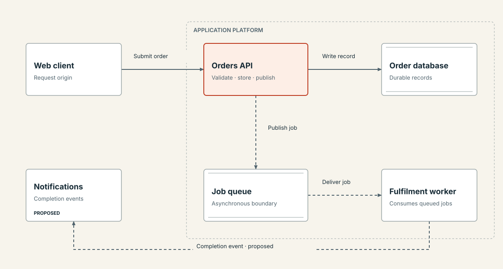
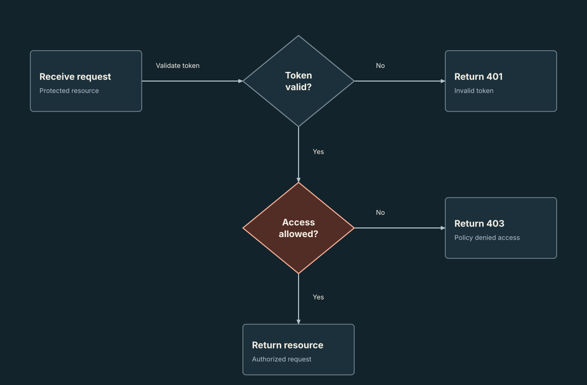

# Diagram Craft

**Accurate diagrams, deliberate visual design, editable sources, and honest verification for Codex.**

Turn source material, application code, or an existing diagram into a visual that explains the relationships clearly. The skill separates the meaning from the layout, records where claims came from, and preserves exceptions instead of trimming them to fit a rigid template.



This is an original skill inspired by [Cathryn Lavery's Diagram Design](https://github.com/cathrynlavery/diagram-design). See [provenance](references/provenance.md) for the reviewed revision and scope of inspiration. It is designed for this Codex collection and has no required connection to that project.

## What it does

- Creates and refines architecture, deployment, data-flow, process, swimlane, sequence, state, ER/schema, dependency, hierarchy, and structural-comparison diagrams.
- Chooses between a concise Mermaid explanation, portable SVG/HTML, or useful interaction according to the request.
- Distinguishes supplied claims, observations, inferences, and proposals; retains an evidence ledger for substantial work.
- Uses existing brand/project tokens or an intentional default palette without a mandatory setup conversation.
- Delivers editable sources and checks rendered output when a capable browser is available.

Use a plotting workflow for quantitative/scientific charts and an image workflow for illustrations. The skill supports specialized notation through agent authoring; the included renderer is deliberately a positioned node-and-edge helper, not a universal diagram engine.

## Practical improvements for our workflow

| Decision | Diagram Craft approach |
|---|---|
| First use | Proceeds using project tokens or a named default; no brand setup gate |
| Style | Adapts to the brief; no universal font, shadow, corner, or connector bans |
| Complexity | Overview/detail follows readability and meaning, not a fixed node count |
| Accuracy | Stable IDs and evidence status on both entities and relationships |
| Editing | JSON source for helper diagrams, standalone SVG, readable HTML tables |
| Verification | Static geometry checks plus optional measured browser checks, with explicit limits |
| Installation | Standard Codex skill folder; offline helper has no third-party dependencies |

This is a focused alternative, not a claim to cover the reference project's complete gallery or import tooling. It does not bundle automatic layout or full Mermaid/draw.io/Excalidraw parsers.

## Install

From a clone of [0xcvaliente/codex-skills](https://github.com/0xcvaliente/codex-skills), copy the complete directory into your skills root, preserving an existing installation:

```bash
task_skill_root="${CODEX_HOME:-$HOME/.codex}/skills"
mkdir -p "$task_skill_root"
if [ ! -e "$task_skill_root/diagram-craft" ] && [ ! -L "$task_skill_root/diagram-craft" ]; then
  cp -R diagram-craft "$task_skill_root/"
else
  echo "diagram-craft already exists; compare local changes before updating."
fi
```

The collection's bundled installer can also download this skill:

```bash
python3 codex-skills/.system/skill-installer/scripts/install-skill-from-github.py \
  --repo 0xcvaliente/codex-skills --path diagram-craft
```

Automatic selection is enabled through the skill description. Invoke `$diagram-craft` explicitly when you want this workflow. Discovery timing depends on your active Codex host; the installed system skill handles installation behavior.

## Example requests

```text
$diagram-craft diagram the checkout request and queued fulfilment path from
this repository. Show implementation evidence and mark unknown behavior.

$diagram-craft redraw this Mermaid sequence as a shareable SVG and HTML.
Preserve its alternative branches, message order, and asynchronous calls.

$diagram-craft compare these before/after architectures with stable IDs
and a small change ledger. Reuse our design tokens.

$diagram-craft review this diagram for incorrect relationships and
unreadable labels, fix confirmed defects, and export a print-ready PDF.
```

## Try the offline helper

Requires Python 3.9+ only. From this skill directory:

```bash
python3 scripts/diagram.py check assets/architecture.scene.json
python3 scripts/diagram.py render assets/architecture.scene.json --output example.html
python3 scripts/diagram.py extract example.html --output example.svg
```

Open `example.html` in a browser. Edit the scene to change labels, evidence, routes, coordinates, or token colors, then regenerate. Output files are preserved unless you explicitly pass `--force`. Input text is escaped; generated files have no JavaScript, remote fonts, analytics, or network dependencies.

See the [scene schema and check limits](references/scene-format.md). The helper validates references, bounds, rectangular obstruction, node/label overlaps, and selected palette contrasts. It estimates wrapping; it cannot establish semantic truth or full visual correctness.

## Rendered checks and optional exports

The browser helper requires an available `playwright` Node package and Chromium browser binary. It never installs them automatically. Use a project installation or your Codex host's bundled runtime and package path.

If the default browser binary is unavailable but a compatible Chromium binary already exists, pass `--browser-executable /absolute/path/to/browser`. For browser regression tests, the equivalent override is the `DIAGRAM_CRAFT_BROWSER` environment variable.

```bash
node scripts/inspect_diagram.cjs example.html --out-dir checks
node scripts/inspect_diagram.cjs example.html --out-dir checks \
  --png example.png --pdf example-companion.pdf --scale 2
```

It writes desktop/mobile screenshots and `report.json`, and returns nonzero for detected defects. It measures annotated text containment, viewBox bounds, orthogonal route obstruction, accessible naming, selected contrast pairs, duplicate IDs, page errors, failed requests, and page overflow. Untagged custom geometry needs manual inspection. These checks are not semantic verification or a complete accessibility audit.

PNG captures the first meaningful root SVG (excluding `aria-hidden="true"` decoration); PDF prints the full HTML companion on A4 landscape and can span pages. Inspect the actual export. [Delivery/import guidance](references/delivery-and-import.md) explains portability, format fidelity, and publication scope.

## Included examples

- [Request/background-work architecture](assets/architecture.html), [SVG](assets/architecture.svg), [editable scene](assets/architecture.scene.json): light palette, asynchronous routes, evidence table, and explicitly proposed notifications.
- [Authorization decision flow](assets/decision-flow.html), [SVG](assets/decision-flow.svg), [editable scene](assets/decision-flow.scene.json): dark palette, decision diamonds, labeled 401/403/success branches.
- [Order sequence](assets/sequence/order-sequence.html), [SVG](assets/sequence/order-sequence.svg), [authoring source](assets/sequence/build_diagram.py), [evidence ledger](assets/sequence/evidence.json): native sequence notation with authorization alternatives, later asynchronous work, fulfilment outcomes, and an explicitly unknown retry policy. Copy this example folder into a working directory before running its authoring script; it writes the example files beside itself.



All examples are synthetic; they make no claims about a real production system. They are starting points, not mandatory templates. The sequence example came from an independent forward test of this skill: the evaluator preserved the supplied branches and unknowns, then caught a frame-heading/lifeline intersection through manual visual review after the automated checks passed.

## Package contents

| Path | Purpose |
|---|---|
| `SKILL.md` | Concise agent entrypoint and selection metadata |
| `agents/openai.yaml` | Codex display metadata and invocation prompt |
| `references/semantics-and-layout.md` | Family-specific meaning and notation contracts |
| `references/visual-system.md` | Styling, geometry, accessible presentation, measured-review limits |
| `references/scene-format.md` | Helper schema, commands, constraints |
| `references/delivery-and-import.md` | Import fidelity, export/embedding, verification receipt |
| `references/provenance.md` | Inspiration and original implementation scope |
| `scripts/diagram.py` | Offline renderer, scene checker, SVG extraction |
| `scripts/inspect_diagram.cjs` | Optional Playwright measurement/capture/export |
| `assets/` | Editable synthetic examples with generated HTML/SVG |
| `tests/` | Helper regression tests and optional browser tests |
| `LICENSE` | MIT terms for this package |

## Validation and maintenance

```bash
python3 -m unittest discover -s tests -v
# Optional: needs the same Playwright/Chromium setup as the browser helper.
node tests/test_browser.cjs
```

For structural skill validation from the collection root:

```bash
python3 .system/skill-creator/scripts/quick_validate.py diagram-craft
```

The structural validator also needs PyYAML. Keep generated examples synchronized with their scenes and inspect changed visuals. Treat a check's stated limits as part of its result. Keep project-specific brand/evidence records in their project, not the globally installed skill. Installed copies require an intentional update after repository changes.

Original files are licensed under [MIT](LICENSE). Source material supplied by users retains its own terms.

## Maintenance — 2026-10-10

Version 1.1.0 corrects diagram selection when decorative SVG icons precede the
figure and compares translated nodes, labels, text, and orthogonal routes in
the root canvas coordinate frame. The inspector reports unsupported transforms
and additional diagrams as unmeasured work. The optional browser suite covers
these cases and verifies that PNG export captures the selected diagram. See
[provenance](references/provenance.md) for the reviewed upstream changes.
